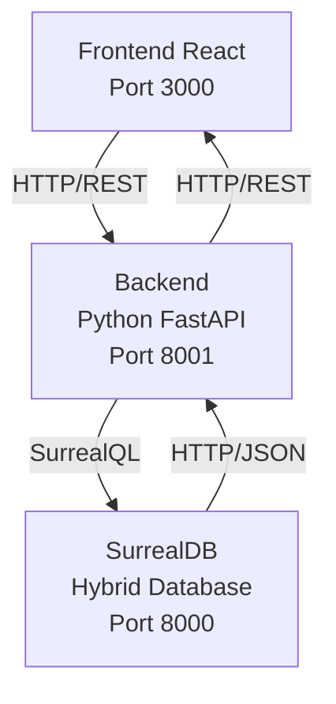

# Film Recommendation System Based on Graph Relations in SurrealDB

**Advanced Databases Course Project**

---

## Slide 1: Title

# Film Recommendation System
## Based on Graph Relations in SurrealDB

**CineBrain Project**

*Advanced Databases Course*

---

## Slide 2: Problem Statement

### The Challenge

**Modern streaming platforms** (Netflix, Disney+, HBO Max) rely on recommendation systems to suggest content to users.

**Traditional database limitations:**
- ❌ Relational databases struggle with flexible relationship modeling
- ❌ Document databases lack native relationship support
- ❌ Complex queries require multiple joins or aggregations

**Our goal:**
Build an efficient recommendation system using **SurrealDB's hybrid approach** (graph + document)

---

## Slide 3: Why SurrealDB?

### The Hybrid Solution

**SurrealDB combines:**
- 📄 **Document Database** - Flexible JSON storage (like MongoDB)
- 🔗 **Graph Database** - Native relationship support (like Neo4j)
- 📊 **Relational Features** - SQL-like queries with graph capabilities

**Key advantages:**
- ✅ Single query for complex relationship traversals
- ✅ Schemaless - no migrations needed
- ✅ Natural syntax: `RELATE` for relationships
- ✅ Built-in REST API

---

## Slide 4: Project Architecture

### CineBrain System Overview



**Deployment:** Docker Compose (one command: `docker-compose up`)

**SurrealDB Response:** HTTP POST to `/sql` endpoint returns JSON body:
```json
[
  {
    "status": "OK",
    "result": [/* query results: arrays of records, objects, or values */]
  }
]
```
Or single object: `{"status": "OK", "result": [...]}`. Errors: `{"status": "ERR", "result": "error message"}`
## Slide 5: Data Model

### Graph Structure

**Entities (Tables):**
- `user` - User information (name, email, age)
- `movie` - Movie details (title, year, director)
- `genre` - Genre categories

**Relationships (Edges):**
- `user ->rated-> movie` - User rates a movie (with score)
- `movie ->belongs_to-> genre` - Movie belongs to genres

**Example:**
```
user:oskar --[rated: score=9]--> movie:inception
movie:inception --[belongs_to]--> genre:sci_fi
```

---

## Slide 6: Data Model - SurrealQL

### Creating the Schema

```sql
-- Create tables (schemaless)
CREATE TABLE user;
CREATE TABLE movie;
CREATE TABLE genre;

-- Create records
CREATE user:oskar SET name = "Oskar", age = 26;
CREATE movie:inception SET title = "Inception", year = 2010;
CREATE genre:sci_fi SET name = "Sci-Fi";

-- Create relationships
RELATE user:oskar->rated->movie:inception 
  SET score = 9, created_at = time::now();

RELATE movie:inception->belongs_to->genre:sci_fi;
```

**Key feature:** No schema migrations needed!

---

## Slide 7: Recommendation Algorithm

### Two Approaches

**1. Similar Movies (Content-Based)**
- Find movies in same genres as user's rated movies
- Based on: genres, directors, actors

**2. Similar Users (Collaborative Filtering)**
- Find users who rated similar movies
- Recommend movies they liked

**SurrealDB enables both with simple graph queries!**

---

## Slide 8: Query 1 - Similar Movies

### Content-Based Recommendations

**Find movies in same genres as user's rated movies:**

```sql
SELECT ->rated->movie->belongs_to-><-belongs_to<-movie 
  AS recommended_movies
FROM user:oskar
FETCH ->rated->movie->belongs_to;
```

**What this does:**
1. Start from `user:oskar`
2. Traverse `->rated->movie` (get rated movies)
3. Traverse `->belongs_to->genre` (get genres)
4. Traverse `<-belongs_to<-movie` (get other movies in those genres)

**Single query, multiple relationship levels!**

---

## Slide 9: Query 2 - Similar Users

### Collaborative Filtering

**Find movies liked by users with similar preferences:**

```sql
SELECT <-rated<-user->rated->movie 
  AS similar_users_movies
FROM movie:inception
FETCH <-rated<-user->rated->movie;
```

**What this does:**
1. Start from `movie:inception`
2. Find users who rated it (`<-rated<-user`)
3. Get movies those users rated (`->rated->movie`)
4. These are recommendations!

**Natural graph traversal syntax**

---

## Slide 10: Comparison - Data Model

### SurrealDB vs MongoDB vs Neo4j

| Feature | SurrealDB | MongoDB | Neo4j |
|---------|-----------|---------|-------|
| **Model** | Hybrid (doc + graph) | Document only | Graph only |
| **Relationships** | Native (RELATE) | Manual references | Native (first-class) |
| **Query Language** | SurrealQL (SQL-like) | MongoDB Query | Cypher |
| **Graph Queries** | Built-in (FETCH) | Aggregation pipelines | Native optimized |
| **Document Storage** | ✅ Yes (JSON) | ✅ Yes (BSON) | ❌ No |

---

## Slide 11: Comparison - Recommendation Query

### Finding Similar Movies

**SurrealDB:**
```sql
SELECT ->rated->movie->belongs_to-><-belongs_to<-movie
FROM user:oskar
FETCH ->rated->movie->belongs_to;
```
✅ Single query, natural syntax

**MongoDB:**
```javascript
// Step 1: Get user's rated movies
const ratings = await db.ratings.find({userId: "oskar"});
// Step 2: Get genres
const movies = await db.movies.find({_id: {$in: ratings.map(r => r.movieId)}});
// Step 3: Get recommendations
const recs = await db.movies.find({genres: {$in: genres}});
```
❌ Multiple queries, manual joins

**Neo4j:**
```cypher
MATCH (u:User {id: "oskar"})-[:RATED]->(m:Movie)-[:BELONGS_TO]->(g:Genre)
MATCH (g)<-[:BELONGS_TO]-(rec:Movie)
WHERE NOT (u)-[:RATED]->(rec)
RETURN DISTINCT rec
```
✅ Single query, optimized for graphs

---

## Slide 12: Comparison - Code Complexity

### Similar Users Query

**SurrealDB (1 query):**
```python
query = """
SELECT <-rated<-user->rated->movie
FROM movie:inception
FETCH <-rated<-user->rated->movie;
"""
result = await surreal_client.query(query)
```

**MongoDB (2+ queries):**
```python
users = await db.ratings.distinct("userId", {"movieId": "inception"})
pipeline = [
    {"$match": {"userId": {"$in": users}}},
    {"$group": {"_id": "$movieId", "count": {"$sum": 1}}},
    {"$sort": {"count": -1}}
]
recommendations = await db.ratings.aggregate(pipeline)
```

**Neo4j (1 query):**
```cypher
MATCH (m:Movie {id: "inception"})<-[:RATED]-(u:User)-[:RATED]->(rec:Movie)
RETURN DISTINCT rec, count(u) as similarity
ORDER BY similarity DESC
```

---

## Slide 13: Performance Comparison

### Recommendation System Use Case

| Aspect | SurrealDB | MongoDB | Neo4j |
|--------|-----------|---------|-------|
| **Graph Traversal** | Good | Poor | Excellent |
| **Document Queries** | Good | Excellent | N/A |
| **Query Complexity** | Low | High | Low |
| **Number of Queries** | 1 | 2-3 | 1 |
| **Learning Curve** | Moderate | Moderate | Moderate |
| **Hybrid Capability** | ✅ Yes | ❌ No | ❌ No |

**SurrealDB: Best balance for hybrid use cases**

---

## Slide 14: When to Choose Which?

### Decision Matrix

**Choose SurrealDB when:**
- ✅ Need both document and graph capabilities
- ✅ Relationship queries are frequent
- ✅ Want simpler query syntax
- ✅ Building new projects
- ✅ Need built-in REST API

**Choose MongoDB when:**
- ✅ Need proven scalability
- ✅ Primarily document-based
- ✅ Complex aggregation pipelines
- ✅ Large ecosystem required

**Choose Neo4j when:**
- ✅ Graph operations are primary
- ✅ Need advanced graph algorithms
- ✅ Complex relationship traversals
- ✅ Best graph query performance needed

---

## Slide 15: Implementation Highlights

### Key Features

**Backend (FastAPI):**
- RESTful API endpoints
- JWT authentication
- SurrealDB client integration
- Recommendation algorithms

**Frontend (React):**
- User registration/login
- Movie browsing
- Rating submission
- Personalized recommendations

**Database:**
- Automatic fixture loading
- Graph relationship queries
- Real-time updates support

---

## Slide 16: Demo - Live System

### CineBrain in Action

**Features to demonstrate:**
1. User registration and login
2. Browse movies and rate them
3. View personalized recommendations
4. Show graph relationships in SurrealDB UI

**Live queries:**
- Similar movies based on genres
- Similar users collaborative filtering
- Graph traversal visualization

---

## Slide 17: Key Takeaways

### What We Learned

**SurrealDB advantages:**
- ✅ Hybrid model combines best of both worlds
- ✅ Natural relationship modeling with `RELATE`
- ✅ Single queries for complex traversals
- ✅ Schemaless flexibility
- ✅ SQL-like syntax (familiar to developers)

**For recommendation systems:**
- Graph relationships are essential
- SurrealDB simplifies complex queries
- Better than pure document DBs for relationships
- More flexible than pure graph DBs for documents

---

## Slide 18: Conclusion

### Summary

**Problem:** Traditional databases struggle with flexible relationship modeling for recommendation systems

**Solution:** SurrealDB's hybrid approach (graph + document) enables efficient recommendation queries

**Results:**
- ✅ Single queries for complex relationship traversals
- ✅ Natural syntax for graph operations
- ✅ Flexible data model without schema migrations
- ✅ Better than MongoDB for relationships
- ✅ More flexible than Neo4j for documents

**Future work:**
- Machine learning integration
- Real-time recommendation updates
- Advanced collaborative filtering algorithms

---

## Slide 19: Questions?

### Thank You!

**Project Repository:**
- GitHub: [CineBrain](https://github.com/...)

**Technologies:**
- SurrealDB - Hybrid Database
- FastAPI - Python Backend
- React - Frontend
- Docker - Deployment

**Contact:**
- Questions welcome!

---

## Slide 20: Appendix - Technical Details

### System Specifications

**Database:**
- SurrealDB v1.x
- Namespace: `test`
- Database: `test`
- Storage: File-based (persistent)

**Backend:**
- Python 3.11+
- FastAPI framework
- JWT authentication
- Async/await pattern

**Frontend:**
- React 18+
- Vite build tool
- Modern UI components

**Deployment:**
- Docker Compose
- Single command setup
- Development and production ready

